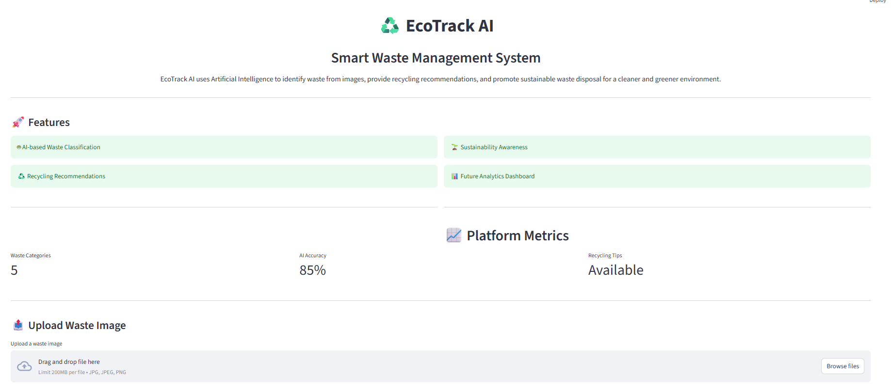
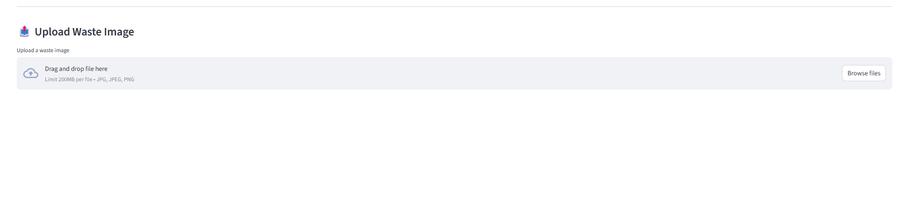
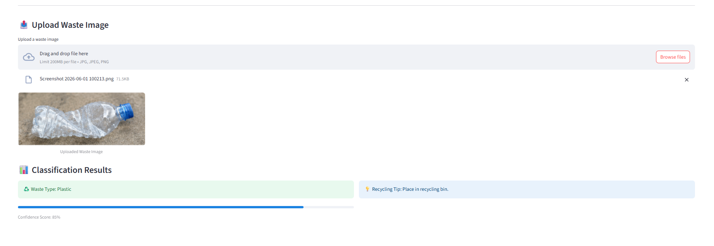

# EcoTrack-AI

AI-powered Smart Waste Management System for waste classification, recycling guidance, and sustainability analytics.

## Features

* Waste Image Classification
* Recycling Guidance
* Sustainability Analytics Dashboard
* Open Source Collaboration

## Tech Stack

* Python
* Streamlit
* TensorFlow
* OpenCV
* Pandas
* NumPy

## Installation

### Clone the Repository

git clone https://github.com/anupala21/EcoTrack-AI.git

### Navigate to the Project Directory

cd EcoTrack-AI

### Install Dependencies

pip install -r requirements.txt

### Run the Application

streamlit run app/main.py

## Project Structure

EcoTrack-AI/
├── app/
├── dataset/
├── docs/
├── models/
├── screenshots/
├── requirements.txt
├── CONTRIBUTING.md
├── README.md
└── LICENSE

## Current Progress

* Repository Setup Complete
* Streamlit Interface Added
* Waste Classification Module Added
* Recycling Recommendation System Added
* AI Model Development In Progress

## Screenshots

### Home Dashboard

### Upload Page

### Plastic Detection

## Future Enhancements

* Route Optimization
* Community Waste Reporting
* Carbon Footprint Analysis
* Mobile Application

## License

MIT License
